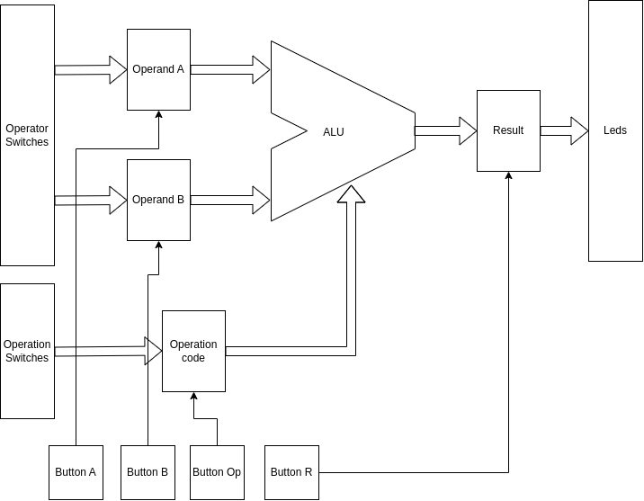
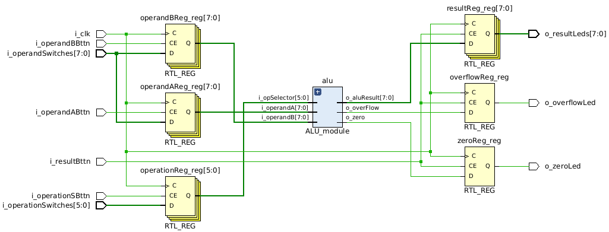
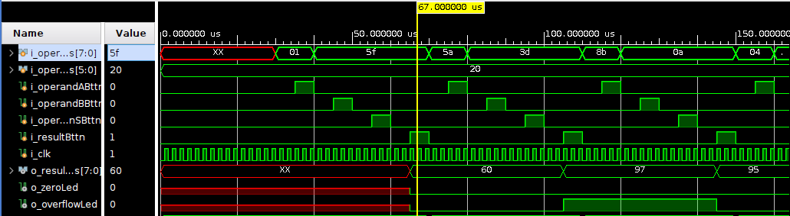

# Módulo ALU

## Trabajo Práctico I - Arquitectura de Computadoras
Implementación de una Unidad Aritmético Lógica en FPGA.

--- 

Preparado por:
- Octavio Ulla  <<octavio.ulla@mi.unc.edu.ar>>
- Francisco Cabrera  <<francisco.cabrera@mi.unc.edu.ar>>

## Diagrama de bloques



En el diagrama en bloques del top level, podemos ver que:
- Los operandos se ingresan a través de una serie de switches. Notar que la entrada es la misma, por lo tanto para cargar el valor de A o B se debe hacer uso de los botones para cargar el registro deseado.
- El código de operación se ingresa a través de otros switches. De igual modo, para cargar el código de operación a la ALU es necesario hacer uso del botón correspondiente.
- El resultado de la operación se presentará en una serie de LEDs una vez que se presione el botón de resultado.
- En el diagrama se obvian las señales de clock para sincronización de entradas.

## Módulo ALU
El módulo ALU, cuenta con dos parámetros que definen la longitud de los datos de entrada y salida (DATA_LEN) y la longitud del código de operación (OP_LEN).

Como entradas, el módulo tiene dos operandos de longitud DATA_LEN y un selector de operación de longitud OP_LEN.

En cuanto las salidas, tiene un resultado de longitud DATA_LEN y dos banderas para el zero y overflow.

``` verilog
module ALU_module #(
    parameter DATA_LEN  = 32,
    parameter OP_LEN    = 6
)
( 
    input wire  [DATA_LEN-1 : 0] i_operandA,
    input wire  [DATA_LEN-1 : 0] i_operandB,
    input wire    [OP_LEN-1 : 0] i_opSelector,
    output wire [DATA_LEN-1 : 0] o_aluResult,
    output wire                  o_zero,
    output wire                  o_overFlow
); 

```
Los detalles del cálculo no se explicitan en este informe. Para más información revisar el archivo `ALU_module.v`.

### Módulo sumador/restador
Para manejar más fácilmente las banderas implementadas y los cálculos, se generó un módulo que se encarga de resolver las sumas y restas y actualizar las banderas de zero y overflow. Luego, este módulo se instancia dentro del módulo ALU para resolver esta parte del cálculo. Este módulo está implementado en el archivo `SumadorRestador.v`

### Operaciones implementadas
Las operaciones que se implementaron en la unidad son las siguientes:

| Operación   |Código de operación|
|:-----------:|:-----------------:|
|ADD          | 100000            |   
|SUB          | 100010            |   
|AND          | 100100            |   
|OR           | 100101            |   
|XOR          | 100110            |   
|SRA          | 000011            |   
|SRL          | 000010            |   
|NOR          | 100111            |   

Para más información sobre las instrucciones, revisar el ISA del MIPS IV.


## Top Level
Una vez que se tiene construido y verificado el módulo ALU, se genera un top para hacer uso de este módulo. El top level cumple con los requerimientos planteados en el diagrama de bloques.

La imagen a continuación, muestra el diagrama RTL generado en Vivado.



## TestBench

Se generaron test bench para cada módulo que se desarrolló, en este caso analizamos la salida del test para el top level que incluye también los tests para la ALU.

El código implementado en el archivo `topLevel_tb.v` realiza una cantidad n de pruebas para cada una de las operaciones implementadas en la ALU y verifica que la salida de la ALU coincida con el cálculo que se hace en el mismo test bench. En caso de encontrar un error, se imprime un mensaje indicando que tipo de error fue y en cual iteración.



La captura presenta la salida del tb. En esta sección se puede notar que inicialmente, hay algunos registros que se encuentran con valores desconocidos, debido a que aún no se les ha asignado nada. 

Luego, la primera operación que se verifica es la suma, podemos analizar el paso a paso hasta que se presenta el resultado a la salida:
- Inicialmente se carga un valor (0x01) en los switches del operando y se genera un pulso en el botón del operando A para cargar el valor.
- Luego se cambia el valor de la entrada (0x5f) y se genera un pulso en el botón del operando B para cargar el valor.
- El valor de la operación ya se encuentra con un valor de 0x20 (operación ADD). Se genera un pulso en el botón del selector para cargar la operación.
- Por último, se genera un pulso en el botón del resultado para que este, se presente a la salida (0x60).
- Luego, vuelve a comenzar el ciclo con diferentes entradas.